# Moodboard
> Les concepts et idées sont listés [ici](https://github.com/MaideAkdede/projet-portfolio)
> * Lien du repo de l'énoncé [hepl-dw/projet-portfolio](https://github.com/hepl-dw/projet-portfolio)
> * [Voir plan du site](./PLAN_SITE.md)
> * Lien du Moodboard Invision [TODO]
* * *

## INPIRATIONS / IDEAS

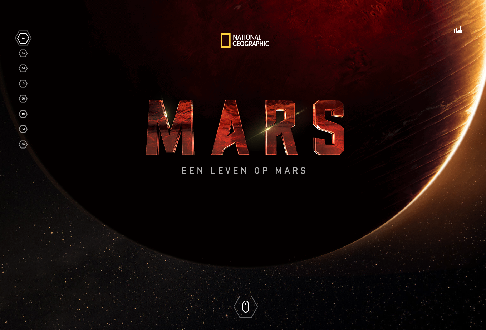

--[Source: Nat Geo TV](https://levenopmars.natgeotv.com/nl/)

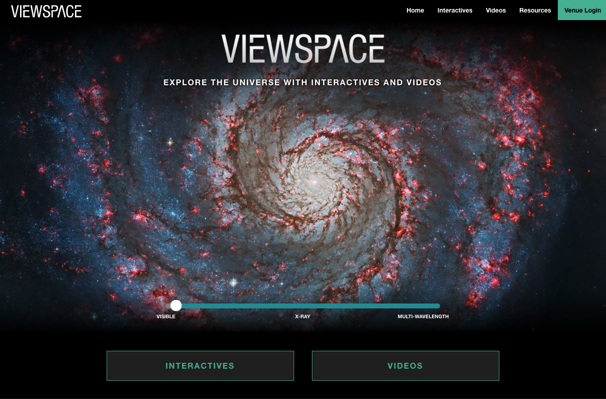

-- [Source : Viewspace](https://viewspace.org/)

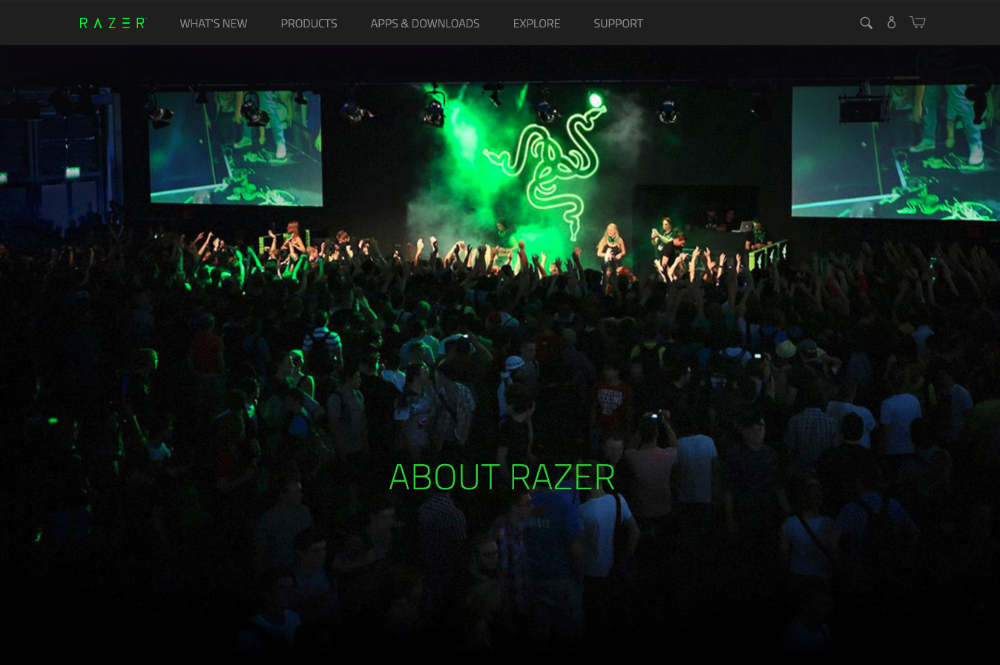

-- [Source : Razer](https://www.razer.com/about-razer)

Autres sites :
- [Acer Predator](https://www.acer.com/ac/fr/BE/content/predator-home)
- [MoonFarmer](https://moonfarmer.com/)
- [Space & Galaxy Background Textures](https://designshack.net/articles/inspiration/best-space-nebula-background-textures/)
***

## BACKGROUND

Ce que je voudrais avoir c'est ceci en background
(avec des mouvements bcp moins rapide et que ça puisse bouger aléatoirement (ou en diagonale, une seule direction) plutôt qu'en rond\
vers le bas pour pousser a scroller ou non un bg FIX me semble bien)

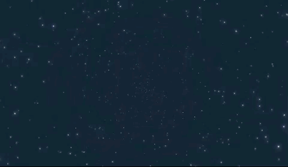

-- [Source : CodePen](https://codepen.io/giana/pen/qbWNYy)

***

## COLOR

Je veux que mes couleurs tournes autour de ces couleurs là.

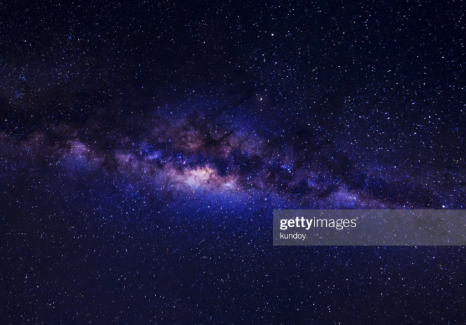

-- [Source : Getty Images](https://www.gettyimages.ch/detail/foto/beautiful-milky-way-with-stars-and-space-dust-on-a-lizenzfreies-bild/963287350?language=fr)

***

## FONT

Ajouter une touche de féminin dans le design avec des polices de titre scripte, assez fine ou élégante

Police : **Grandslang roman**

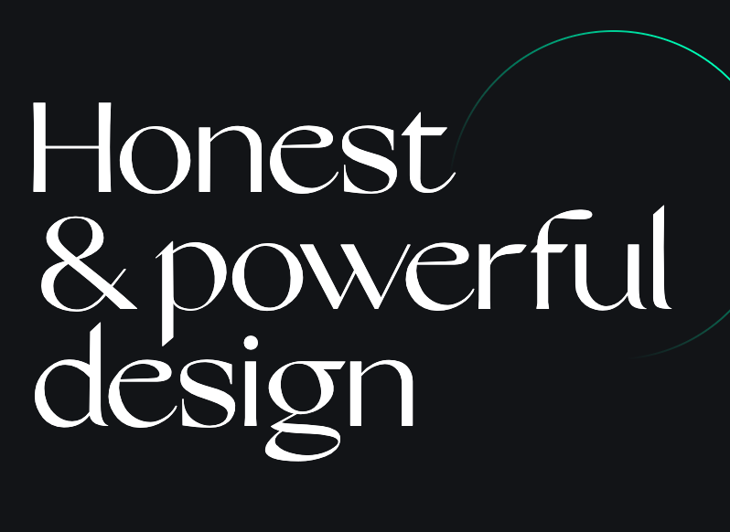

-- [Source : The Art of Visual](https://theartofvisual.com/)

[TODO : chercher d'autre polices du style]

Police : **IvyMode**

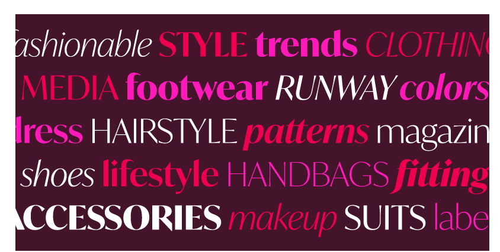

-- [Source : Adobe Font]
-- [Source : My Sweet Dreams]

***

## SCROLL

Inciter au scroll avec un bouton similaire (cliquable)

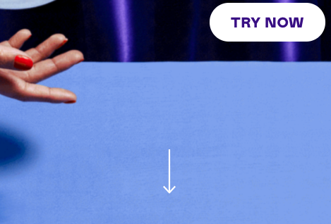

-- [Source : MagicSpoon](https://magicspoon.com/)

***

## CTA

J'aimerais faire un bouton comme ceci (Pour la validation du formualaire de contact par exemple)

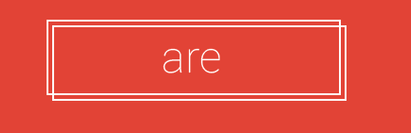

-- [Source : Union Square Design](https://www.unionsquaredesign.com/wp-content/uploads/2016/11/ghost-buttons.png)

Lui donner un hover comme ceci (ou autre)

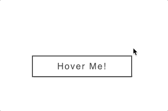

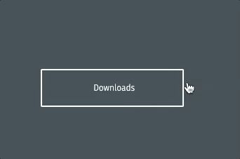

-- [Source : Dev.To](https://dev.to/webdeasy/top-20-css-buttons-animations-f41)

***

## HOVER TEXT LINKS or MENU

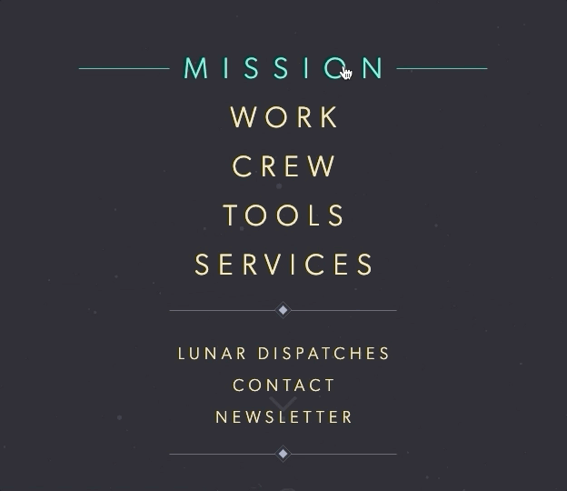

--[Source : Moonfarmer(https://moonfarmer.com/)
